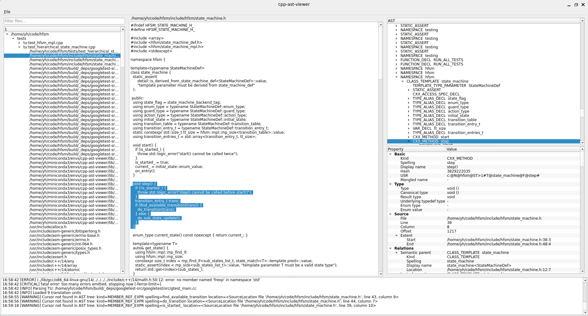

# cpp-ast-viewer


[](LICENSE)
[](https://github.com/SyaoranY/cpp-ast-viewer/releases)

An interactive C++ AST viewer built with Python, PySide6, and libclang.

`cpp-ast-viewer` visualizes the Clang AST of a C++ project together with its source code. It uses the project's `compile_commands.json` to parse translation units with their actual compilation arguments and provides interactive navigation between source code and AST nodes.


## Screenshot




## Features

- Load C++ projects from `compile_commands.json`
- Browse translation units and included source/header files
- Filter files by name
- Explore the Clang AST in a tree view
- Lazy-load AST nodes when expanding the tree
- Navigate from an AST node to its source code
- Click source code to locate the corresponding AST node
- Automatically highlight the source range of the selected AST node
- Inspect detailed cursor information, including:
  - kind and spelling
  - type information
  - source location and extent
  - semantic and lexical parents
  - referenced declarations and definitions
  - C++-specific properties
  - function arguments
  - tokens
- Display Clang diagnostics and application logs

## Requirements

- Python 3.10 or later
- A C++ project with a valid `compile_commands.json`

The Python dependencies are installed automatically:

- PySide6
- libclang-ng

## Installation

Clone or download the repository, then install it from the project root:

```bash
python -m pip install .
```

For development, install it in editable mode:

```bash
python -m pip install -e .
```

After installation, start the application with:

```bash
cpp-ast-viewer
```

Alternatively:

```bash
python -m cpp_ast_viewer
```

## Generating `compile_commands.json`

`cpp-ast-viewer` uses the compilation database to obtain the compiler arguments required to correctly parse each translation unit.

For a CMake project, generate it with:

```bash
cmake -S . -B build -DCMAKE_EXPORT_COMPILE_COMMANDS=ON
cmake --build build
```

The compilation database will normally be generated at:

```text
build/compile_commands.json
```

Other build systems can also be used as long as they produce a valid `compile_commands.json`.

## Usage

1. Start `cpp-ast-viewer`.
2. Load the `compile_commands.json` of your C++ project.
3. Select a translation unit from the file panel.
4. Select a source or header file to display its source code.
5. Expand nodes in the AST tree to explore the parsed syntax tree.
6. Click an AST node to jump to and highlight its source code.
7. Click a position in the source code to locate the corresponding AST node.
8. Inspect the selected cursor's properties in the AST details panel.

The main window consists of four areas:

```text
┌──────────────┬──────────────────────┬──────────────────────┐
│              │                      │      AST Tree        │
│  File Panel  │     Source View      ├──────────────────────┤
│              │                      │     AST Details      │
├──────────────┴──────────────────────┴──────────────────────┤
│                         Log View                           │
└────────────────────────────────────────────────────────────┘
```

### File Panel

Displays translation units and their included files. The search box can be used to quickly filter files.

### Source View

Displays the currently selected source/header file. Selecting an AST node highlights its corresponding source range.

### AST View

Displays the Clang AST for the selected translation unit. AST nodes are loaded lazily as the tree is expanded.

The details panel below the tree displays information about the currently selected Clang cursor.

### Log View

Displays parsing progress, Clang diagnostics, warnings, and application errors.

## Notes

The AST is generated in the context of a translation unit. As a result, the same header file may have different AST representations when included by different translation units because of compiler options, macros, include paths, and other compilation context.

When loading a compilation database, the translation units are parsed using their recorded compilation arguments. Large projects or projects with many translation units may therefore take some time to load.

Parsing quality depends on the correctness of the compilation database and whether the recorded compiler arguments and include paths can be understood by libclang.

## License

This project is licensed under the MIT License. See [LICENSE](LICENSE) for details.
